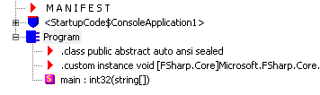

# Learning F# baby steps (step 1)

I have started looking into functional programming languages and since my background is in Microsoft Stack I'm interested in F#. I have started attending local user group ([Sydney FSharp user groupt](http://www.meetup.com/fsharpsydney/)) which is usually in our office. Generally functional aspect of programming sounds really interesting and seems promissing. FSharp in particular has some additional benefits which make this programming language even more interesting. Things like interoperability with other CLR languages like C#, Type providers. F# is multi-paradigm language with strong functional attitude. F# Is originated from ML and has been influenced by OCaml, C# and other multi-paradigm languages.

I have desiced to write some blog post along the way I learn this language and share this with others. My opinion is not necossarily a proffesional opinion and infact I'm new to functional programming and F#. So please feel free to comment on my notes.

## How to start
### Hello world

We as programmers tend to write hello world in every languages. Well, I thought this could be a good start for me as well. But I will add a twist to this and try to change code and dig into the generated code and learn new stuff in F# language.

Well, to create a hello world application what you need is a Visaul Studio (in my case I used Visual Studio 2013 professional)

To write a Hello world program in F# you just need to open Visual Studio go to File>New>Project> Other Languages> Visual F#>Windows and then select Console Application.

Once you have created the console application the code looks like following.

```FSharp

[<EntryPoint>]
let main argv = 
    printfn "%A" argv
    0 // return an integer exit code
```
Allright, this code just print all arguments into console. lets change this to show Hello world. It seems we just need to change one line of code 

```FSharp

[<EntryPoint>]
let main argv = 
    printfn "Hello world"
    0 // return an integer exit code
```

And it print hello world into console. Well lets take a step back and check what has happened. The fist thing is `[<EntryPoint>]` which is syntax for Attributes and the `EntryPoint` is [EntryPointAttribute](https://msdn.microsoft.com/en-us/library/ee353789.aspx) defined in core classes which tells the runtime following function is entry point in the executable assembly. Just like other .net programming language, we have a main method to start. You can find more details about EntryPoint in F# [here](https://msdn.microsoft.com/en-us/library/dd402151.aspx).

The next thing in the source code is `let` keyword. `let` is probably the most important keyword in F# you can find full MSDN documentation [here](https://msdn.microsoft.com/en-us/library/dd233238.aspx) but in nutshell `let` is _binding_ associates an identifier with a value or function. A simple binding is like following 

```FSharp
let i = 1
```

This will bind value `1` to `i`. Or:

```FSharp
let Sqr x = x * x
```

This will bind expression to Sqr with parameter x and return x * x. later on we will learn more about `let`. 

Back to our hello world example, the 'let main argv' means binding main with argv parameter and the body is the rest of two lines. A good trick in visual studio is to find out types by moving mouse over the variable and functions. If you move mouse over the `main` function and a tooltip apears on top of the `main`:

```
val main: argv:string [] -> int
```

This is actually signature of the binding. This is important to be able to read this syntax. I'll be writing a post about this syntax but for now this means:

_main binding accepts parameter argv of type string array and returns an integer_

OK, You might have heared that F# has great type infering system. But infering type of `argv` is awesome. The reason visual studio identified `argv` as string[] is becuase we defined the main function as `EntryPoint`. This is type inferring on steroid. Following is MSDN description about `main` function:

> The entry point function has type string array -> int. The arguments provided on the command line are passed to the main function in the array of strings. The first element of the array is the first argument; the name of the executable file is not included in the array, as it is in some other languages. The return value is used as the exit code for the process. Zero usually indicates success; nonzero values indicate an error. There is no convention for the specific meaning of nonzero return codes; the meanings of the return codes are application-specific.

When I run this application it closes too fast, I'm a C# developer and I usually use Console.Readline to stop closing the windows to fast when I run console application. How can I use this. Well, we are in .net so I just need to use ~~`using`~~ `open` to include `System` namespace becuase Console class lives there. So `open` is equvalent of `using` in F#. And the I have to add another line before returning 0 to read from console. Right?

```FSharp
[<EntryPoint>]
let main argv = 
    printfn "%A" argv
    Console.ReadLine()     
    0 // return an integer exit code
```

This code compiles and runs as expected. It waits until user hit enter and the closes the windows. But there is a warning in the output. 

> This expression should have type 'unit', but has type 'string'. Use 'ignore' to discard the result of the expression, or 'let' to bind the result to a name.	

`Console.ReadKey()` returns an object of type 'ConsoleKeyInfo' but we are using it as a statement without assigning the return value to anything. So F# warns us that we are ignoring a value. ignore takes any type and returns nothing. In F# we can explicitely ignore a return value by using `Operator.ignore` or `ignore` So a revised version would be:

```FSharp
[<EntryPoint>]
let main argv = 
    printfn "%A" argv
    Console.ReadLine()     
    |> ignore
    0 // return an integer exit code
```

Which leads us to another important operator which is forward pipe operator. Forward pipe operator is one on most important operators in F# which helps us to write our programs more fluently and declarative. Badically this operator passes left operand as last parameter of right operand which is binding and accept parameters (one or more). In our example passes return value of `Console.ReadLine()` to `ignore` as parameter. 

### Interoperability with C#

Last thing I want to check is that whow this main class look like if I want to access that in a C# project. To test this I add a C# console application into this solution and reference the F# console application. In `Program.Main()` body I try to access main in F# project by typing 'ConsoleApplication1.Program.main()' but it is not accessible. I inspect the generated `IL` by `ildasm.exe` and it looks like following.



There is no namespace and there is a `Program` class with a static method `main` class should be accessible using following syntax:

```FSharp
global:Program.main(args);
```

The fact that there is no namespace in the F# code it will automatically falls into global namespace. 

Back to our C# code, if we change the name of class to Program1 (to avoid conflict) we can access `main` with the above syntax.

### How to define namespaces in F#
?????

### Wrap up
????


